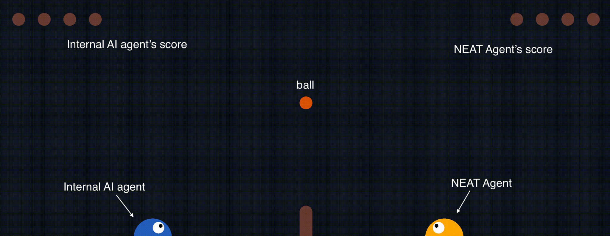

Solutions to Sakana AI Technical Problem Set 0.5.1

**Part** **1:** Training a NEAT network to play neural slime volleyball

> **1.** **Game** **Environment** **Setup**

The NEAT agent was evolved in the “SlimeVolley-v0” game environment,
where it competes against an internal AI opponent. The setup is
illustrated in Figure 1 below:

> Fig. 1: Environment of “SlimeVolley-v0” game where we evolve NEAT
> agent (orange - right) to play against the internal AI agent (blue -
> left).

Agent Roles

> ● Player 1 (opponent): Internal AI controlled by an RNN policy. ●
> Player 2: NEAT agent, evolved to play against the opponent. ● Ball:
> The object of play (Obs)
>
> **2.** **Reward** **structure** **for** **NEAT** **agent:**

The reward system is designed to encourage the NEAT agent to engage
actively in the game while maintaining its life. The following rewards
and penalties are assigned:

> ● Hitting the ball: + 0.5 reward
>
> ● Hitting the ball and moving it toward the opponent: + 1.0 reward
>
> ● Ball hitting the fence and moving toward the opponent: +0.5 reward ●
> Losing a life: - 2.0 penalty
>
> ● Opponent losing a life: +2.0 reward

The values assigned to these rewards are the result of multiple tests
that have been conducted. The reward values were determined through
multiple tests to reflect the game’s competitive nature, emphasizing
survival and strategic play.

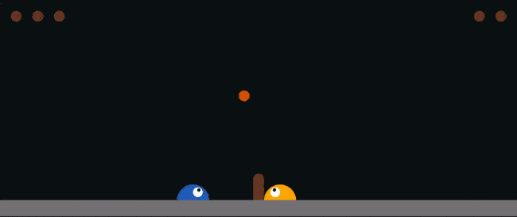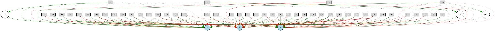

> **3.** **Fitness**

The fitness of an agent is determined by combining the scores and
rewards obtained by the NEAT agent during the game.

> 𝐹𝑖𝑡𝑛𝑒𝑠𝑠 = 𝑠𝑐𝑜𝑟𝑒𝑠 + 𝑡𝑜𝑡𝑎𝑙 𝑟𝑒𝑤𝑎𝑟𝑑

Scores:

> ● When the opponent agent loses a life, NEAT agent will gain 1 score.
> Thus, there's a total of 5 scores in a game.

Total reward:

> ● The accumulation of rewards obtained by the NEAT agent during the
> game.

The population is then divided into several species through speciation,
based on their fitness. This approach encourages the selection process
that identifies suitable parents for reproduction in the next
generation.

> **4.** **NEAT** **Network** **Structure**

The NEAT agent’s network structure evolved significantly over
generations. The initial network structure (Figure 3) and the network
structure at the 5000th generation are depicted below in Figure 2:

> Fig. 2: The gif showing the NEAT agent juggling the ball during the
> game.
>
> Fig. 3: Initial network structure at 10th generation.

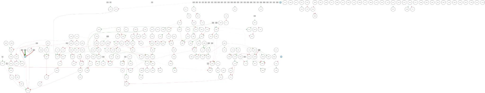

> Fig. 4: Network structure at 5000th generation.

Despite the expansion and complication of the network as in Figure 4,
the output for jumping (Output 2) had no connections, indicating the
agent’s preference for moving forward and backward to juggle the ball.

> **5.** **NEAT** **Evolutionary** **Algorithm** **Setup:**

Configurations:

> ● Population Size: 200 (to maintain diversity.)
>
> ● Fitness threshold: 5000 (not too high, but not too low, to allow
> exploration.)

Node activation options:

> ● Default Activation: Random ● Mutation Rate: 0.5
>
> ● Activation Functions: identity gauss sin tanh sigmoid

After several trials, these settings were found suitable for evolving
the genome effectively in the game.

Connection enable options

> ● Enabled Default: True ● Mutation Rate: 0.01
>
> ● Feed Forward: True (only feedforward connections were implemented.)

Node addition/ Remove Rates: ● Input nodes: 48

> ○ Consist of 48 flattened features derived from the game observations,
> capturing essential state information necessary for the agent to
> decide on its actions, such as:
>
> ■ Positions and velocity of NEAT agent and opponent. ■ Positions and
> velocity of the ball.
>
> ■ Current reward of the game. ● Output nodes: 3
>
> ○ The output consists of three possible movements for the agent:
> Forward, Backward and Jump.

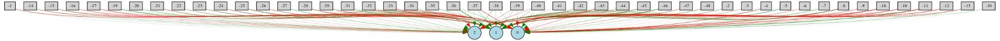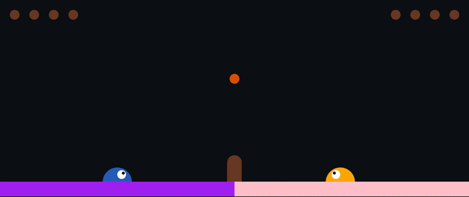

> ● Hidden nodes: 0

● Compatibility threshold: 3.0 (For the reasonable formation of species
in the population) Reproduction Settings:

> ● Elitism: 5
>
> ● Survival Threshold: 0.3
>
> **6.** **Dependencies**

**To** **run** **the** **experiment** **environment** **on** **macOS,**
**ensure** **the** **following** **packages** **are** **installed:**

> ● pyglet==1.5.15 ● gym==0.19.0
>
> ● Additionally, add Graphviz to the PATH. This is necessary even after
> installing Graphviz included in the NEAT packages.
>
> **7.** **Results**

The NEAT agent successfully won the game after 2500 generations. 15
trials have been conducted, and the best genome from the best trial has
been demonstrated as in Figure 5 to Figure 9 in the following sections.
are illustrated below, showcasing the changes.

**Visualizations** **of** **the** **evolution** **of** **the**
**behavior** **of** **NEAT** **agent** **and** **the** **network**
**structure**

10th Generation:

> Fig. 5: The network structure of the best genome in the population
> during the 10th generation (top) and the gif showing the behavior of
> NEAT agent.

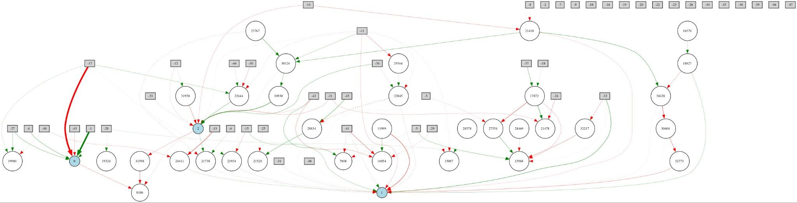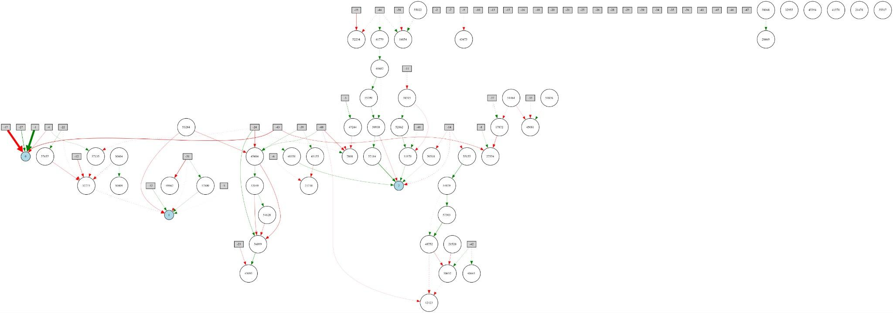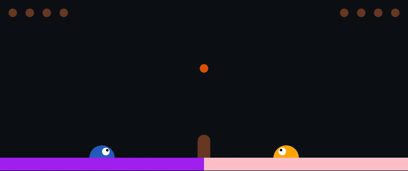

500th Generation:

> Fig. 6: The network structure of the best genome in the population
> during the 500th generation (top) and the gif showing the behavior of
> NEAT agent.

1000th Generation:

> Fig. 7: The network structure of the best genome in the population
> during the 1500th generation (top) and the gif showing the behavior of
> NEAT agent.

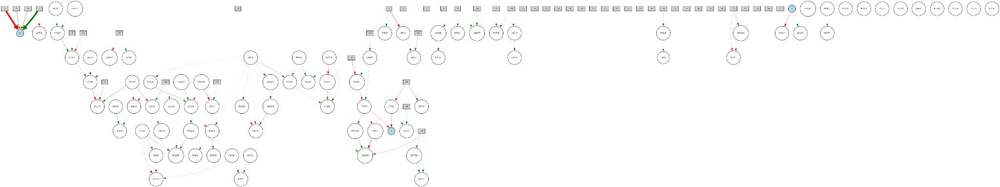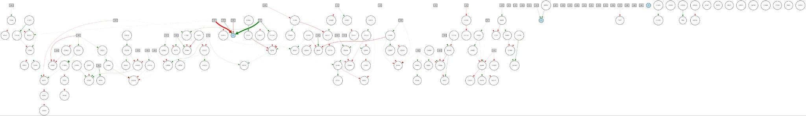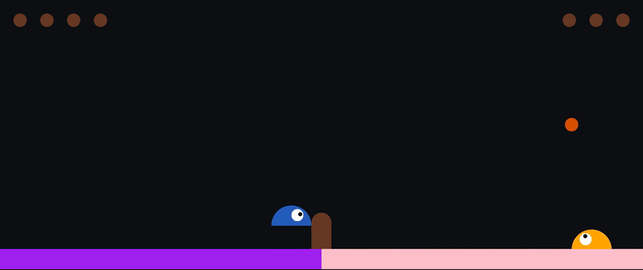

2000th Generation:

> Fig. 8: The network structure of the best genome in the population
> during the 2000th generation (top) and the gif showing the behavior of
> NEAT agent.

2500th Generation:

> Fig. 9: The network structure of the best genome in the population
> during the 2500th generation (top) and the gif showing the behavior of
> NEAT agent.

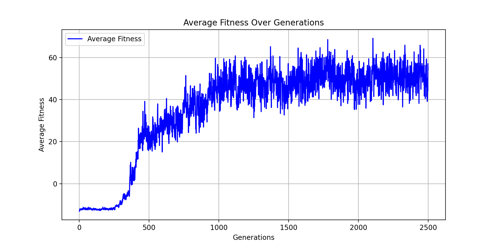

The average fitness of the population over the generation:

> Fig.10: The average fitness of the population over the generations.

Summarization of the evolution of NEAT agent throughout the generation:

||
||
||
||
||
||

||
||
||
||
||

> **8.** **Conclusions**

Unexpected behaviors emerged during the evolution of the NEAT agent,
including a reluctance to jump when sending the ball to the opponent and
a tendency to more easily receive low balls. While these behaviors are
quite unusual for games of this nature, they were nonetheless developed
by the NEAT algorithm. Although the agents did not consistently win and
sometimes lost due to timeouts, the emergence of these strategies
demonstrates the agent's unique adaptation to game dynamics,
highlighting the complexity and unpredictability of evolutionary
algorithms in training NEAT agents.

Looking ahead, there is a need to refine the reward structure further.
Implementing time constraints and introducing penalties for failing to
achieve certain fitness values within the game's timeframe could enhance
the agent's performance and adaptability.

> **9.** **References**

\[1\] Neural Slimevolleybal gym:
[<u>https://github.com/hardmaru/slimevolleygym</u>](https://github.com/hardmaru/slimevolleygym)

\[2\] Jaafar, S. A. B., Suzuki, R., & Arita, T. (2025). Eco-Evo-Devo in
the Adaptive Evolution of Artificial Creatures Within a 3D Physical
Environment. Electronics, 14(2), 354.
[<u>https://doi.org/10.3390/electronics14020354</u>](https://doi.org/10.3390/electronics14020354)
